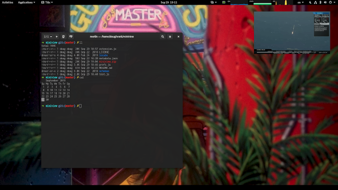

miniview
========

GNOME Shell plugin that shows a preview of another window (like picture-in-picture on a TV)



### Usage

- Left-mouse drag: move preview window
- Right-mouse drag (or ctrl + left mouse drag): resize preview window
- Scroll wheel: change target window
- Double click: raise target window
- Shift + F12: toggle preview window (this can be changed or disabled in preferences)
- Ctrl + scroll wheel: adjust opacity

### Installation

You can install the latest official release through [extensions.gnome.org](https://extensions.gnome.org/extension/1459/miniview/). This should be fine for most people.

To install the development version, clone this repository locally and create a symlink to the Gnome Shell extensions directory. If you cloned miniview into MINIVIEW, this would look like

```
ln -s MINIVIEW ~/.local/share/gnome-shell/extensions/miniview@thesecretaryofwar.com
```

After that just restart Gnome Shell. If you're in Xorg you can just hit `Alt+F2` and run `r`, and if you're in Wayland you have to logout and log back in.

### Contributors

Thanks to these awesome folks!
- [@antielektron](https://github.com/antielektron)
- [@jonnius](https://github.com/jonnius)
- [@amivaleo](https://github.com/amivaleo)
- [@dontfreakout](https://github.com/dontfreakout)
